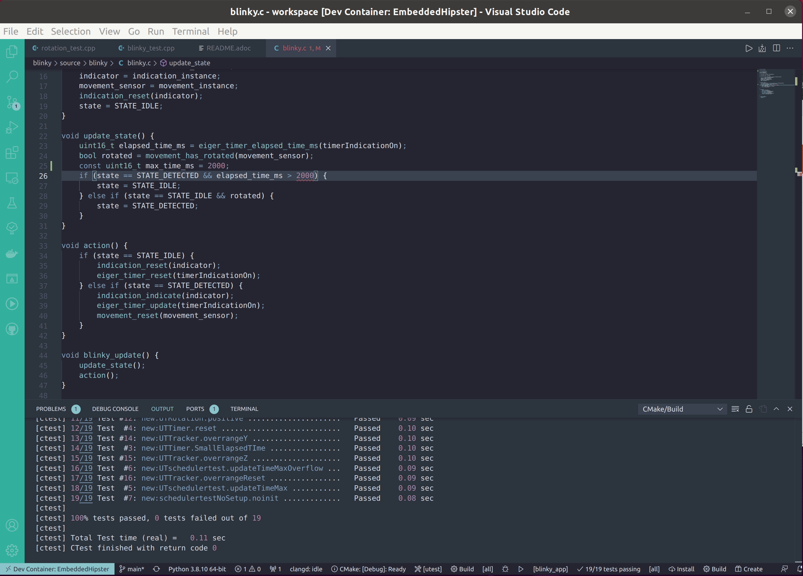

= DisroopEmbeddedHipster

:url-ci: https://github.com/disroop/DisroopEmbeddedHipster/actions/workflows/ci.yml
image::https://github.com/disroop/DisroopEmbeddedHipster/actions/workflows/ci.yml/badge.svg[Badge,link={url-ci}]

image:https://bestpractices.coreinfrastructure.org/projects/5035/badge[Badge,link=https://bestpractices.coreinfrastructure.org/projects/5035]

:uri-sonar: https://sonarcloud.io/dashboard?id=disroop_DisroopEmbeddedHipster
image:https://sonarcloud.io/api/project_badges/measure?project=disroop_DisroopEmbeddedHipster&metric=bugs[Badge,link={uri-sonar}]
image:https://sonarcloud.io/api/project_badges/measure?project=disroop_DisroopEmbeddedHipster&metric=code_smells[Badge,link={uri-sonar}]
image:https://sonarcloud.io/api/project_badges/measure?project=disroop_DisroopEmbeddedHipster&metric=coverage[Badge,link={uri-sonar}]
image:https://sonarcloud.io/api/project_badges/measure?project=disroop_DisroopEmbeddedHipster&metric=duplicated_lines_density[Badge,link={uri-sonar}]
image:https://sonarcloud.io/api/project_badges/measure?project=disroop_DisroopEmbeddedHipster&metric=ncloc[Badge,link={uri-sonar}]
image:https://sonarcloud.io/api/project_badges/measure?project=disroop_DisroopEmbeddedHipster&metric=sqale_rating[Badge,link={uri-sonar}]
image:https://sonarcloud.io/api/project_badges/measure?project=disroop_DisroopEmbeddedHipster&metric=alert_status[Badge,link={uri-sonar}]
image:https://sonarcloud.io/api/project_badges/measure?project=disroop_DisroopEmbeddedHipster&metric=reliability_rating[Badge,link={uri-sonar}]
image:https://sonarcloud.io/api/project_badges/measure?project=disroop_DisroopEmbeddedHipster&metric=security_rating[Badge,link={uri-sonar}]
image:https://sonarcloud.io/api/project_badges/measure?project=disroop_DisroopEmbeddedHipster&metric=sqale_index[Badge,link={uri-sonar}]
image:https://sonarcloud.io/api/project_badges/measure?project=disroop_DisroopEmbeddedHipster&metric=vulnerabilities[Badge,link={uri-sonar}]

DisroopEmbeddedHipster is a showcase project which demonstrates how to create modern C/C++ embedded applications with a modular architecture and implementing CI/CD practices.

== Get started
- Install the following tools on your computer:

* https://www.docker.com/products/docker-desktop[Docker-Desktop]

* https://code.visualstudio.com[VsCode]

* https://marketplace.visualstudio.com/items?itemName=ms-vscode-remote.remote-containers[VsCode Plugin - Remote Container]

- Clone the repo and open with VsCode.

[source,console]
----
git clone https://github.com/disroop/DisroopEmbeddedHipster.git
cd ./DisroopEmbeddedHipster
code .
----
- Start the container with the remote container plugin.

image::doc/open_run_unit_test_arm.gif[]

== Features
* Reproducible and traceable builds with a fully automated toolchain
* Traceability (git history, build history, hashes, ... , timeline in sonar, ...)
* Build-In Quality
** Code Analysis
** Coverage Analysis
** https://sonarcloud.io/organizations/disroop/projects?search=hipster[Sonar]
* Build Automation
** Project CLI with invoke
** https://github.com/disroop/DisroopEmbeddedHipster/actions[GitHub Actions]
** https://azure.microsoft.com/de-de/services/devops/pipelines/[Azure-Pipelines -todo]
** https://www.jenkins.io/[Jenkins -todo]
* Artifact based software development process
** source->build->artifact (bin, reports, ..)
* Quality Gateways
* Standardisation of toolchain

// können wir das ins doc.adoc verschieben?
To help developers to get immediately feedback there is builtin quality in the IDE. For example linting tools or test coverage view.

== Tools
* Using https://hub.docker.com/u/disroop[Docker] to manage the toolchain
* Easy to set up developer environment in 10 seconds.
* Use https://docs.conan.io/en/latest/[Conan] as package manager
* Use https://cmake.org/[CMake] in a https://cliutils.gitlab.io/modern-cmake/[Modern CMake] manner
* Use https://disroop.jfrog.io/[Artifactory] to manage artifacts
* Modular Architecture
* Testing: Unittest, Conan Package-Tests, Test on the Hardware
* Supported testing frameworks: https://github.com/google/googletest[Gtest], https://github.com/catchorg/Catch2[Catch2], http://cpputest.github.io/[Cpputest]
* Use modern IDEs: https://code.visualstudio.com/[VsCode] and https://www.jetbrains.com/de-de/clion/[Clion]
* Focusing on https://en.wikipedia.org/wiki/ARM_Cortex-M[ARM Cortex-M]

For more information read the <<doc/doc.adoc#,documentation>>

Try our VsCode extension

https://marketplace.visualstudio.com/items?itemName=disroop.conan
